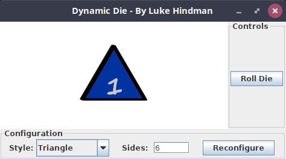
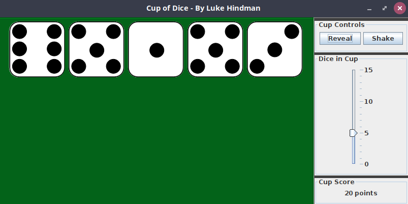

# Lab08 Guide
## Getting Started
[Lab Introduction Video]()
- Please clone the [Mod08 Code Examples](https://github.com/lhindman/cs121-mod08-examples.git). 

### Code Style Requirements
Please review the [CS121 Style Guide](https://docs.google.com/document/d/1LWbGQBKkApnNAzzgwOSvRM03DmhYWx5yEfecT2WXfjI/edit?usp=sharing) and apply it in all lab activities and projects this semester. Coding Style will assessed as part of your lab and project grades.

### Code Quality Requirements
- Code must compile without warnings using openjdk11
- Code must run without errors or warnings on safe-path and edge test cases
- More to come as we learn about input validation and exception handling  
## Activity 1 - Dynamic Die
### Problem Description
In the lecture videos 

### Implementation Guide
1. Expand the folder named A1-NumberCounter and create a new file named NumberCounter.java
2. Design a program to satisfy the requirement in the Problem Description and enter the program code in NumberCounter.java
3. Test the program and pay particular attention to boundary/edge cases and invalid input.
4. Commit the changes to your local repository with a message stating that Activity 1 is completed.
5. Push the changes from your local repository to the github classroom repository.

## Activity 2 - Cup of Dice
### Problem Description

Design and implement an application that creates a histogram that allows you to visually inspect the frequency distribution of a set of values. The program should read in an arbitrary number of integers that are in the range of 1 to 100 inclusive; then it should produce a chart similar to the following on that indicates how many input values fell in the range 1 to 10, 11 to 20, and so on. Print one asterisk for each value entered.

     1 - 10   | *****  
    11 - 20   | **  
    21 - 30   | *************************  
    31 - 40   |   
    41 - 50   | ***  
    51 - 60   | *******  
    61 - 70   | **  
    71 - 80   | *****  
    81 - 90   | *******  
    91 - 100  | *********  

### Implementation Guide
1. Expand the folder named A2-NumberStats and create a new file named NumberStats.java
2. Design a program to satisfy the requirements in the Problem Description and enter the program code in NumberStats.java
3. Test the program and pay particular attention to boundary/edge cases and invalid input.
4. Commit the changes to your local repository with a message stating that Activity 2 is completed.
5. Push the changes from your local repository to the github classroom repository.
